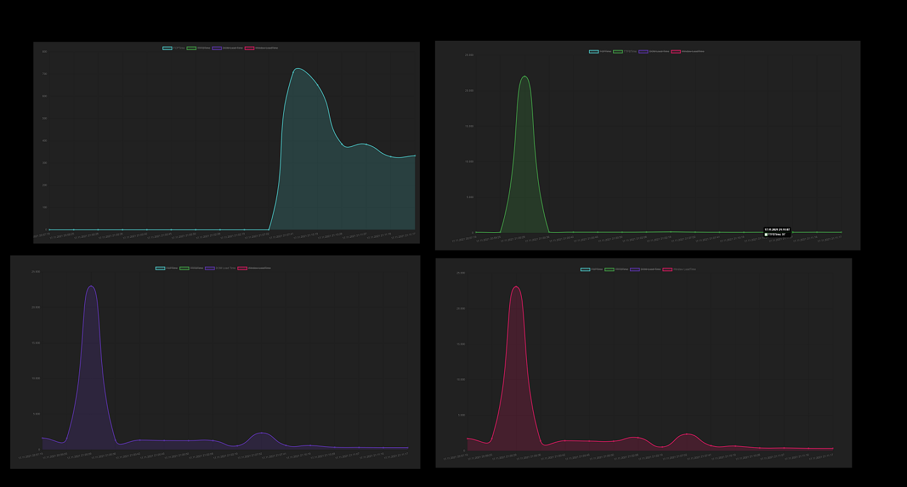

# Performance Analytics Dashboard

[DEMO](https://perfanalytics-dashboard-fe.herokuapp.com/) - First opening can take a while because of heroku's free dyno.

This application shows the performance metrics of itself from last 30 minutes.



## Install

```
$ npm install
```
## Commands

- `npm start` - Start applicaiton in development mode
- `npm run build` - Build application for production.